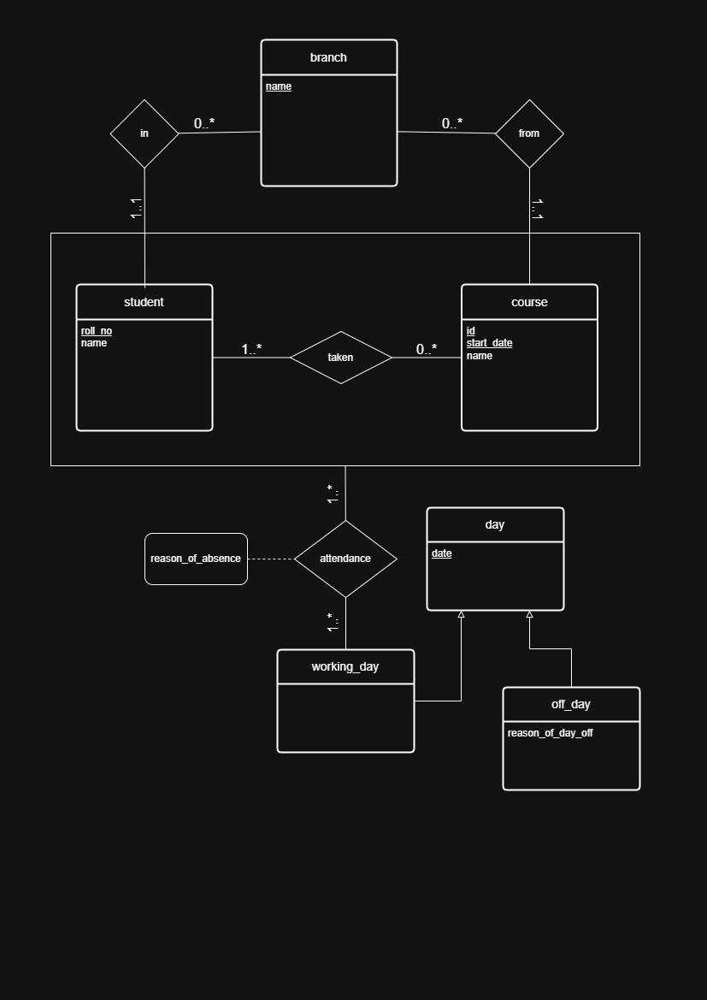

# 📘 Student Attendance Management System  
**Database Management Systems Lab Project**

## 📌 Functional Requirements

### Student Perspective
1. View the **attendance percentage** for all enrolled courses.
2. Access a **detailed attendance view** for each course, including:
   - Days marked as off days  
   - Days the student was absent  
   - Reasons for absence submitted by the teacher
3. Identify courses in which the student’s attendance **falls below the required percentage threshold**.

### Teacher Perspective
1. **Mark attendance** for a specific course on a specific date using student roll numbers.
2. **Add reasons for student absences** (reasons may also be added or updated at a later time).
3. View a list of **students whose attendance is below a specified percentage threshold**.
4. Mark the day when classes are off.
## 📌 ER Diagram

## 🛠️ Technologies Used
- **Database:** MySQL  
- **Language:** SQL  
- **Tools:** MySQL Workbench, draw.io

### Key Concepts To Use:
- Entity-Relationship (ER) Model
- Aggregation
- Specialization
- Schema
- Views
- Authorization
- Primary Key
- Foreign Key  
- Normalization 
- Joins and Subqueries
 

## 👥 Team Members
| Name          | Roll Number |
|---------------|-------------|
| Bhavya Biju   |  23BCS125   |
| Vansh Pal     |  23BCS122   |
| Vir Daksh     |  23BCS123   |
| Virendra Sahu |  23BCS124   |

## 🏫 Course Information
- **Course Name:** Database Management Systems Lab
- **Course Code:** CS-325  
- **Institution:** National Institute of Technology Hamirpur  
- **Semester:** 6
- **Academic Year:** 2026  

## 📄 Conclusion
The Student Attendance Management System provides an efficient and reliable way to manage attendance records using database management techniques. This project strengthens the understanding of database concepts and their practical applications.
